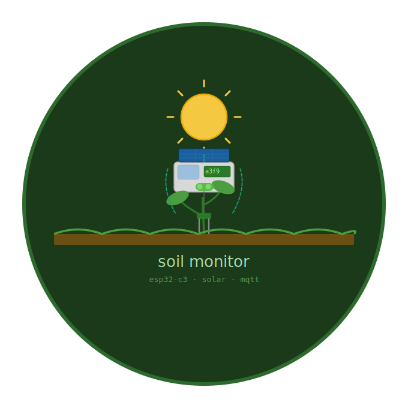
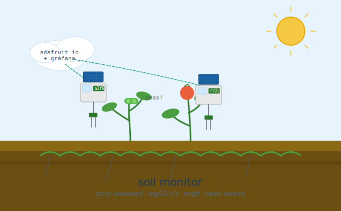
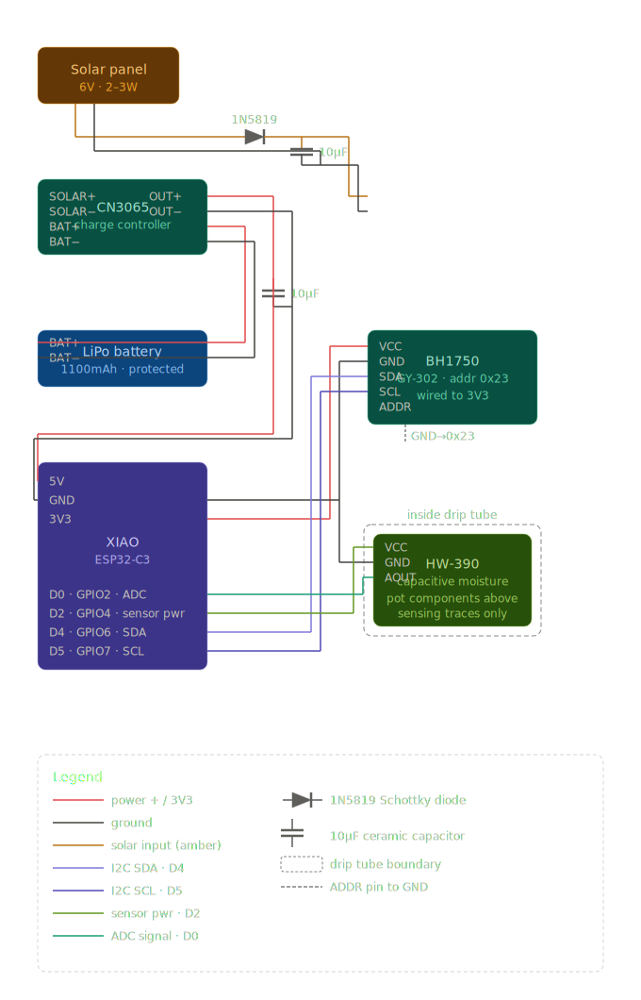

# 🌱 Soil Moisture Sensor

<p align="center">
  
</p>

Hey there, plant parent! 👋 Welcome to your new best gardening gadget – a Soil Moisture Sensor! This little ESP32-powered wonder keeps tabs on your plants' soil moisture and light levels, so you can give them the perfect TLC they deserve. No more guessing if your greens are thirsty or basking in just the right amount of sunshine!

<p align="center">
  
</p>


## ✨ What's This Magic?

A smart sensor that:
- 📊 Measures soil moisture percentage (0-100%)
- ☀️ Tracks light levels in lux
- 🌐 Serves up a beautiful web dashboard right from the device
- 📡 Publishes data to Adafruit IO for remote monitoring
- 💤 Goes to sleep to save battery (wakes every ~28 minutes)
- 🔋 Runs on battery power for weeks!

## 🛠️ Hardware You'll Need

### Core Components
- **Seeed Xiao ESP32C3** - The brain of the operation
- **Capacitive Soil Moisture Sensor** - The thirsty plant's voice
- **BH1750 Light Sensor** - Your sunshine detective
- **Battery Pack** - Keep it running (3.7V LiPo recommended)
- **Jumper Wires** - Connect it all together

### Wiring Diagram

<p align="center">
  
</p>

**Pro Tip:** Power the soil sensor through a digital pin (D2) so we can turn it off to save battery and prevent corrosion!

## 🚀 Getting Started

### 1. Set Up Your Development Environment
You'll need PlatformIO – it's like Arduino IDE but supercharged for pros!

1. Install [PlatformIO IDE](https://platformio.org/) in VS Code
2. Clone or download this project
3. Open the project folder in VS Code

### 2. Configure Your Secrets
Copy the template and fill in your details:
```bash
cp secrets.ini.template secrets.ini
```

Edit `secrets.ini` with your WiFi and Adafruit IO credentials:
```ini
[env:seeed_xiao_esp32c3]
build_flags =
    -DWIFI_SSID=\"YourWiFiName\"
    -DWIFI_PASS=\"YourWiFiPassword\"
    -DAIO_USERNAME=\"your_adafruit_username\"
    -DAIO_KEY=\"your_adafruit_io_key\"
```

### 3. Get Your Adafruit IO Setup
1. Sign up at [Adafruit IO](https://io.adafruit.com/)
2. Create two feeds for your device:
   - `{your_username}-soil-moisture`
   - `{your_username}-soil-light`

### 4. Upload the Code
1. Plug in your ESP32C3
2. Click the PlatformIO upload button (or run `pio run -t upload`)
3. Watch the magic happen!

### 5. Plant It!
1. Bury the soil sensor in your plant's pot (not too deep!)
2. Place the light sensor where your plant gets its sun
3. Power it up and watch the data flow!

## 🌐 Check Your Data

### Local Web Dashboard
Connect to your home WiFi and visit `http://soil-monitor.local` (or find the IP in your router). You'll see beautiful gauges showing moisture and light levels!

### Adafruit IO Dashboard
Head to [io.adafruit.com](https://io.adafruit.com) to see your data from anywhere. Create dashboards, set up alerts, and track your plant's happiness over time!

## ⚙️ Customization

Want to tweak the behavior? Check out these settings in `src/main.cpp`:

- **Sleep Cycle**: Change `SLEEP_SECONDS` (default: 1680 = 28 minutes)
- **Awake Time**: Adjust `AWAKE_SECONDS` (default: 120 seconds)
- **Sensor Calibration**: Fine-tune `AIR_VALUE` and `WATER_VALUE` for your soil

## 🔧 Troubleshooting

**Can't connect to WiFi?**
- Double-check your SSID and password in `secrets.ini`
- Make sure you're in range of the network

**Weird moisture readings?**
- Calibrate your sensor: Dry = ~3440, Wet = ~1170 (adjust in code)
- Clean the sensor probes if they're corroded

**Light sensor not working?**
- Check I2C connections (SDA=D4, SCL=D5)
- BH1750 address is 0x23 (default)

**Battery draining too fast?**
- Increase sleep time or reduce awake window
- Check for shorts in your wiring

## 🤝 Contributing

Got ideas to make this even better? PRs welcome! Let's make plant care awesome together.

## 📄 License

This project is open source – hack away and share your improvements!

---

Happy planting! 🌿 Your plants will thank you (and so will your thumbs – green or not!) 🌱
